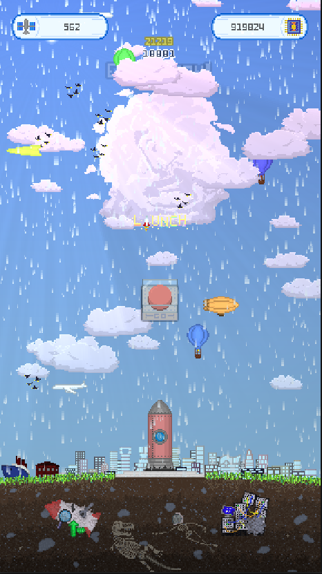
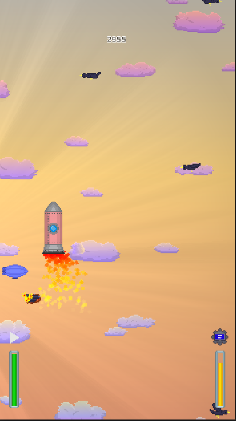
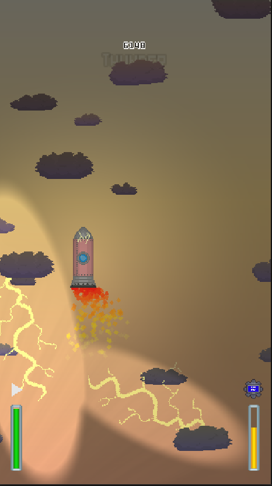
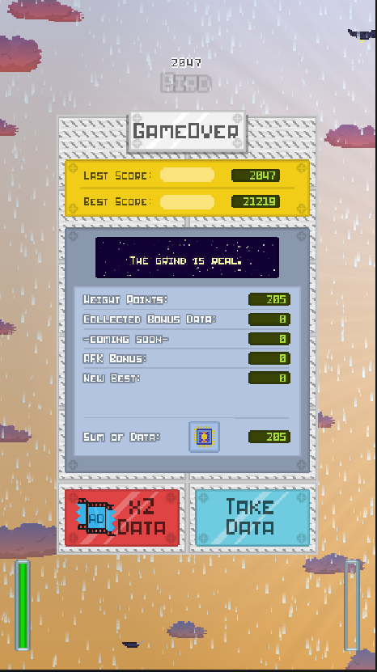
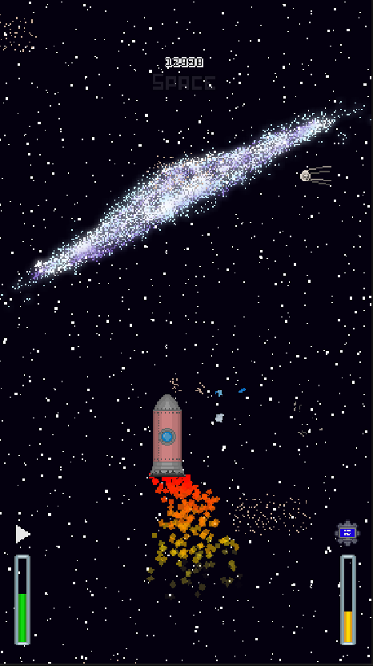
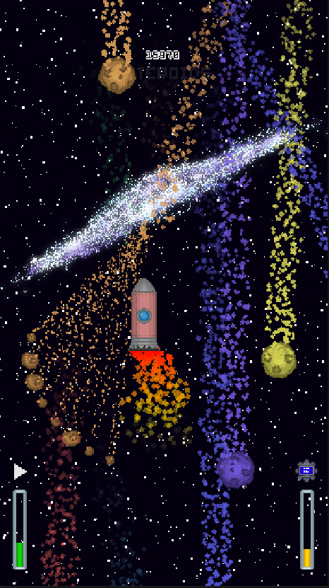

# AstroDodge

A expedition/survival game made with Godot.

## Gameplay

Dodge incoming obstacles and survive as long as possible.
Upgrade your rocket and unlock new Skins.

## Screenshots

## Features

- Fast arcade gameplay
- Score system
- Increasing difficulty
- Pixel art visuals

## Controls

Android:
- Touch to move and interact

Windows and Linux:
- "LMB"(LeftMouseButton) to move and interact
- Cheats:
-   "D" : Go to next Day Time
-   "W" : Change Weather
-   "A" : Add Currency (10 Satellite and 10.000 Data)
-   "K" : Kill Player instantly
-   "L" : Remove Fuel
-   "B" : Make the Player stand still

## Installation

Download the latest release and run the executable.
